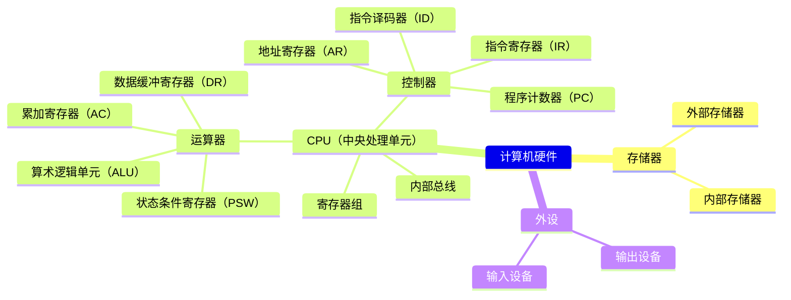
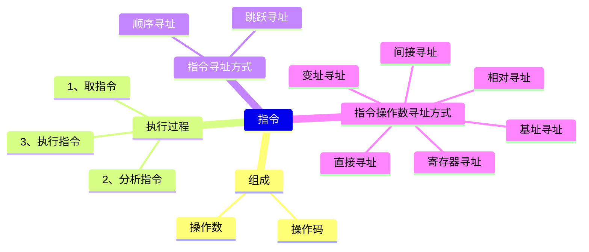
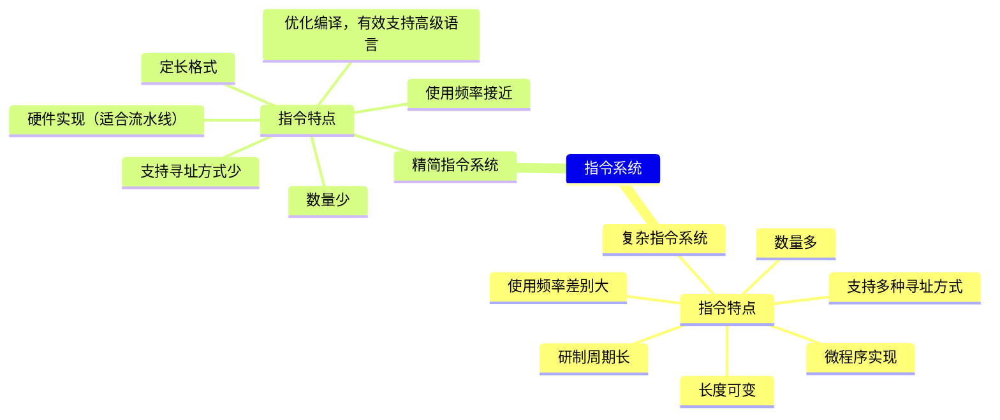

# 计算机硬件

## 校验码

### 码距

> A:00 **码距**为1
> A:00 转换为 B:11 **码距**为2

码距的概念：在两个编码中，从A码到B码所需要**改变的位数**称之为码距。

码距越大，越利于**纠错和检错**。

### 奇偶校验码

在编码中增加1位校验位来使编码中1的个数为**奇数**或**偶数**，从而使得码距变为2。

奇校验可以检测编码中**奇数个数据位**出错。当合法编码中的
奇数位发生错误时，也就是编码中的0变成了1或者1变成了0，会导致编码中的1的个数的奇偶性发生变化，从而**实现检错**，但**不能纠错**！

### 循环冗余校验码CRC

CRC**只能检错**，**不能纠错**。原理是找一个能够整除多项式的编码，将原始报文除以多项式，将所得余数添加在原始报文之后，作为发送数据发送给接收方。

#### CRC校验码计算
> 信息码字为111000110，生成多项式G(X)=x^5+x^3+x+1，则计算出的CRC校验码为？

**解法：**

- 首先确定多项式的最高幂次数为**5**，即校验码位数为**5**。（此时可以排除一部分选项）。
- 转换多项式（**101011**）
- 将信息码左移**5**位作为被除数
- 执行模2除法，即异或操作（**同0异1**）
- 得到余数**11001**（即校验码）

```计算过程
101011/111000110
       101011
       010011110
        101011
        00110010
          101011
          011001（最终结果）
```

## 计算机硬件和指令

### 计算机硬件的基本系统

- 运算器
- 控制器
- 存储器
- 输入设备
- 输出设备



#### 运算器
执行所有的算术运算，如加减乘除等；执行所有的逻辑运算并进行逻辑测试，如与、或、非、比较等
- ##### 算术逻辑单元 ALU
    实现对数据的算术运算和逻辑运算。
- ##### 累加寄存器 AC
    运算结果或源操作数的存放区。
- ##### 数据缓冲寄存器 DR
    暂时存放内存的指令或数据。
- ##### 状态条件寄存器 PSW
    保存指令运行结果的条件码内容，如溢出标志等。
#### 控制器
控制整个CPU的工作，最为重要。
- ##### 指令寄存器 IR
    暂存CPU执行指令
- ##### 程序计数器 PC
    存放指令执行地址
- ##### 地址寄存器 AR
    保存当前CPU所访问的内存地址
- ##### 指令译码器 ID
    分析指令操作码

#### 指令
CPU依据指令周期的不同阶段来区分二进制指令和数据。




## 指令系统




### 复杂指令系统 CISC
兼容性强、指令繁多、长度可变、由微程序实现。
### 精简指令系统 RISC
指令少、使用频率接近、主要依靠硬件实现。

## 指令的流水处理

### 流水线原理

```mermaid
gantt
title 未使用流水线执行指令情况
todayMarker off
dateFormat  D
section 取指令
1:1, 1d
2:4, 1d
3:7, 1d
section 分析指令
1:2,1d
2:5,1d
3:8,1d
section 执行指令
1:3,1d
2:6,1d
3:9,1d
```

```mermaid
gantt
title 使用流水线执行指令情况
todayMarker off
dateFormat  D
section 取指令
1:1, 1d
2:2, 1d
3:3, 1d
section 分析指令
1:2,1d
2:3,1d
3:4,1d
section 执行指令
1:3,1d
2:4,1d
3:5,1d
```





> 按照重叠流水线方式执行指令，执行完所有指令的时间？

**解法：**

假设取指令需要时间**t1**，分析指令需要**t2**，执行指令需要**t3**，从头到尾要执行**n**条指令。

执行完所有指令的时间=**max(t1,t2,t3)\*(n-1)+t1+t2+t3**。

#### RISC中的流水线技术

- ##### 超流水线
    在每个机器周期内能完成一个甚至两个浮点操作，以时间换空间
- ##### 超标量
    内装多条流水线同时执行多个处理，以空间换时间
- ##### 超长指令字VLIW
    同时执行多条指令，发挥软件作用

### 流水线时间计算

**流水线周期**：指令分为不同执行段，执行时间最长的段称为流水线周期。

**流水线的执行时间**：【1条指令执行的总时间+(总指令条数-1)\*流水线周期】

**流水线吞吐率计算**：吞吐率即单位时间内执行的指令条数。【吞吐率=指令条数/流水线执行时间】

**流水线的加速比计算**：【加速比=不使用流水线执行时间/使用流水线执行时间】

> 假设某计算机采用5级流水线结构执行指令，设每条指令的执行由取指令t1、分析指令t2、去操作数t3、运算t4、写回结果t5组成，并分别由5个子部完成，该流水线的最大吞吐率为？若连续向流水线输入n条指令，则该流水线的加速比为？

**解法：**

最大吞吐率 = $\frac{1}{max(t1,t2,t3,t4,t5)}$

加速比 = $\frac{(t1+t2+t3+t4+t5)*n}{max(t1,t2,t3,t4,t5)*(n-1)+t1+t2+t3+t4+t5}$

## 存储系统

### 计算机存储结构层次

#### 计算机存储结构层次图

<p align=center></p>

#### 采用分级存储体系的主要目的

解决**存储容量**、**成本**和**速度**之间的矛盾问题。

#### 二级存储映像

Cache-主存、主存-外存（虚拟存储体系）

#### 分类

- 按存储器所处位置分为：内存、外存
- 按存储器构成材料：磁存储器（磁带）、半导体存储器、光存储器（光盘）
- 按存储器工作方式：可读可写存储器（RAM），只读存储器（ROM只能读，PROM可写入一次，EPROM和EEPOM既可以读也可以写）
- 按存储器的访问方式：按地址访问、按内容访问（相联存储器）
- 按寻址方式：随机存储器（访问任意存储单元所用时间相同）、顺序存储器（只能按顺序访问，如磁带）、直接存储器（二者结合，如磁盘，对于磁道的寻址是随机的，在一个磁道内则是顺序的）

### 局部性原理

#### 局部性原理

在CPU运行时，所访问的数据会趋向于一个较小的局部空间地址内。（例如循环操作，循环体被反复执行）

#### 时间局部性原理

如果一个数据项正在被访问，那么在近期它可能会被再次访问，即在相邻的时间里会访问同一个数据项。

#### 空间局部性原理

在最近的将来会用到的数据的地址和现在正在访问的数据地址很可能是相近的，即相邻的空间地址会被连续访问。

### 高速缓存Cache

用于存储当前最活跃的程序和数据，直接与CPU交互，位于CPU和主存之间，容量小，速度为内存的5-10倍，由半导体材料构成，其内容是主存内存的副本拷贝，对于程序来说是透明透明的。

Cache由控制部分和存储器组成，存储器存储数据，控制部分判断CPU要访问的数据是否在Cache中，在则命中，不在则依据一定的算法从主存中替换。

#### 地址映射方法

在CPU工作时，送出的是主存单元的地址，而应从Cache存储器中读/写信息。这就需要将主存地址转换为Cache存储器地址，这种地址的转换称为地址映像，由硬件自动完成映射。

- 直接映像

将Cache存储器等分成块，主存也等分成块并编号。主存中的块与Cache中的块的对应关系是固定的，也即二者块号相同才能命中。地址变换简单但不灵活，容易造成资源浪费。（说人话就是**一对一**）

- 全相联映像

同样都等分成块并编号。主存中任意一块都与Cache中任意一块对应。因此可以随意调入Cache任意位置，但地址变换复杂，速度较慢。因为主存可以随意调入Cache任意块，只有当Cache满了才会发生冲突，是最不容易发生块冲突的映像方式。（说人话就是**多对多**）

- 组组相连映像

前面两种映像方式的结合，将Cache存储器先分块再分组，主存也同样先分块再分组，组间采用直接映像，即内存中组号与Cache中组号相同的组才能命中，但是组内全相联映像，也即组号相同的两个组内的所有块可以任意调换。（说人话就是**外部一对一**，**内部多对多**）

#### 命中率及平均时间

命中率：当CPU所访问的数据在Cache中时，命中，直接从Cache中读取数据。

平均时间：设读取一次Cache时间为1ns，若CPU访问的数据不在Cache中，则需要从内存中读取，设读取一次内存的时间为1000ns，若在CPU多次读取数据过程中，有90%命中Cache，则CPU读取一次的平均时间为：(90%\*1+10%*1000)ns

即 $平均时间=命中率*读取一次Cache时间+（1-命中率）*读取一次CPU时间$。

### 虚拟存储器

虚拟存储器技术是将很大的数据分成许多较小的块，全部存储在外存中。运行时，将用到的数据调入主存中，马上要用到的数据置于缓存中，这样，一边运行一边进行所需数据块的调入/调出。

对于应用程序来说，就好像有一个实际主存空间大得多的虚拟主存空间，基本层级为：主存-缓存-外存。与CPU-高速缓存Cache-主存的原理类似。但虚拟存储器中程序无需考虑地址映像关系，由系统自动完成，因此对于程序来说是透明的，其管理方式分为：页式、段式、段页式。

### 磁盘

#### 磁盘结构和参数

磁盘有正反两个盘面，每个盘面有多个同心圆，每个同心圆是一个磁道，每个同心圆又被划分为多个扇区，数据就被存放在一个个扇区中。

#### 存取时间计算

$存取时间 = 寻道时间 + 等待时间$

寻道时间是指磁头移动到磁道所需的时间，等待时间为等待读写的扇区转到磁头下方所用的时间。

#### 磁盘调度算法

- 先来先服务FCFS

根据访问磁盘的先后顺序调度（说人话就是**先来后到**，我管你这那的）

- 最短寻道时间优先SSTF

请求访问的磁道与当前磁道最近的进程优先调度，使得每次的寻道时间最短，会产生“饥饿现象”，即远处进程可能永远无法访问。（说人话就是**就近原则**，但可能最远的那个一直处于等待）

- 扫描算法（电梯算法）SCAN

磁头在磁盘上双向移动，其会选择离磁头当前所在磁道最近的请求访问的磁道，并且与磁头移动方向一致，磁头永远都是从里向外或者从外向里一直移动完才掉头，与电梯类似。（说人话就是低配版电梯，把移动方向一致的都按距离消费完，就扭头消费另一个方向）

- 单向扫描调度算法CSCAN

与SCAN唯一的不同就是，CSCAN只做单向移动，以电梯举例，固定方向为向上，上升到最高层后，直接回到最底层，继续向上。
