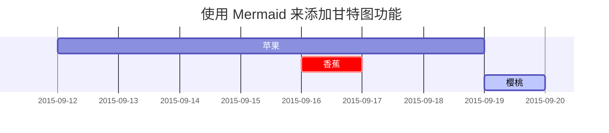

---
# the default layout is 'page'
icon: fas fa-info-circle
order: 4
---

# 📖 Publications

- Yang Yang, Shuailong Qiu, Lanling Zeng, and Zhigeng Pan. 2024. Detail-preserving Joint Image Upsampling. ACM Trans. Multimedia Comput. Commun. Appl. 20, 8, Article 251 (August 2024), 23 pages. [🔗](https://doi.org/10.1145/3665246)

# 🏃‍♂️ Marathon

> 2023 苏州太湖马拉松 `半程马拉松` 成绩 `01:39:05` `半马PB`
{: .prompt-tip }

- 2024 第十三届苏州环金鸡湖半程马拉松 `半程马拉松` 成绩 `02:00:36`
- 2024 江苏省大学生马拉松联赛暨醉美校园江苏大学马拉松赛 `16KM` `学生组男` 成绩 `01:11:41`

